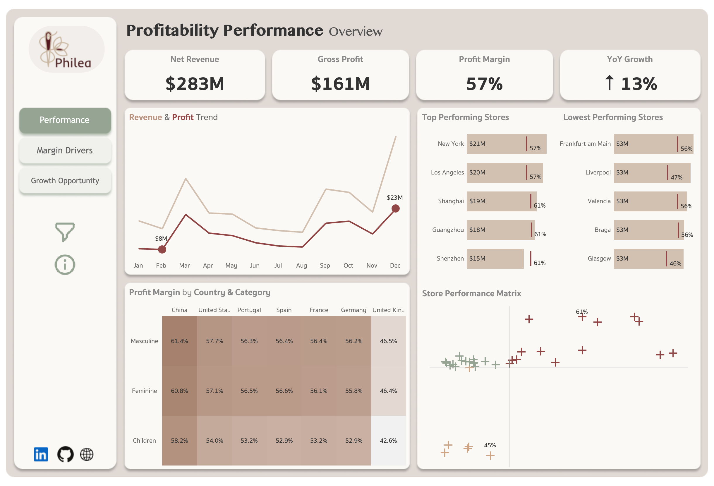
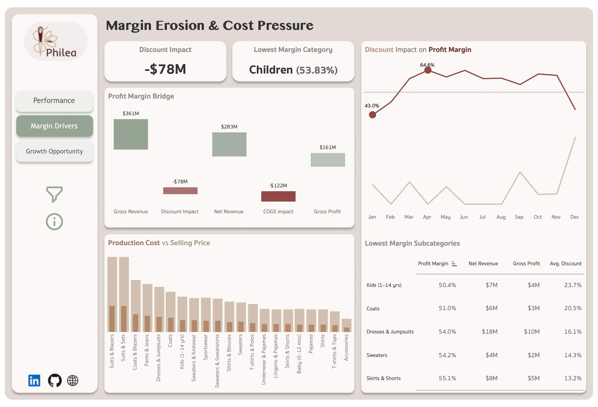
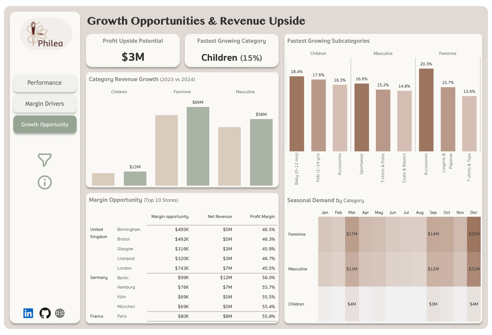

# Business Performance, Margin & Growth Analysis – Philea 

## Business Context
Philea is a multinational fashion retailer operating across 35 stores in 7 countries, offering products across Feminine, Masculine, and Children's categories. Despite strong revenue growth, leadership requires greater visibility into profitability performance, margin pressure, and future growth opportunities across markets and stores.

>**The challenge** is not simply understanding how much revenue the business generates, but identifying where profit is created, where margin is being lost, and where future growth investment should be focused.

### Objectives
1. How is the business performing overall?
2. What factors are reducing profitability?
3. Where are the strongest growth opportunities?

These questions are addressed through three interconnected dashboards covering business performance, margin diagnostics, and growth potential.

## 🎯 Executive Summary
Philea generated **\$283M in Net Revenue** and **$161M in Gross Profit**, achieving a **57% profit margin** and **13% year-over-year growth** across its global retail network.

While overall profitability remains strong, the analysis identified significant margin pressure from discounting and production costs. **Discount activity alone reduced revenue by $78M**, with margin erosion concentrated in specific product categories and subcategories.

Growth analysis highlighted **Children's as the fastest-growing category** and identified **$3M in profit improvement opportunity** across underperforming stores. The largest store-level profit improvement opportunities is concentrated in the United Kingdom, Germany, and France, where several locations continue to operate below network benchmarks.   
**View the dashboard** [here]()

## Dashboard Overview & Key Findings

<br>

**Purpose:**
Provide a high-level view of revenue, profitability, and store performance across the business.

**Key Findings:**
- Generated \$283M in net revenue and $161M in gross profit, resulting in a 57% profit margin.
- Revenue and gross profit peaked during December, confirming strong year-end seasonal demand.
- Top-performing stores consistently achieved margins above 57%, with several exceeding 60%. 
- China achieved the highest profit margins across all categories (58%-61%), while the United Kingdom recorded the lowest margins (42%-46%).
- Store segmentation identified 14 star performers and 6 underperforming stores, highlighting clear differences in revenue and profitability performance.
---

<br>

**Purpose:** Identify the primary factors reducing profitability and quantify their impact on margin performance.

**Key Findings:**
- Gross revenue of \$361M was reduced by \$78M in discounts and \$122M in production costs, resulting in \$161M of gross profit.
- Children's recorded the lowest overall category margin at 53.8%.
- Higher discount rates consistently aligned with lower profit margins throughout the year.
- Despite healthy selling prices across subcategories, discounting and production costs significantly reduced realized profitability.
- Discounting and production costs emerged as the largest drivers of margin erosion.
---

<br>

**Purpose:** Identify the highest-value opportunities for future revenue and profitability growth.

**Key Findings:**
- Children's achieved the strongest year-over-year growth at 15%.
- Feminine remained the largest revenue-generating category, reaching $69M in revenue during 2024.
- Multiple subcategories delivered double-digit growth, led by Accessories (20%), Babies 0–12 Months (18%), and Sportswear (16%).
- \$3M in profit improvement opportunity was identified across underperforming stores, with the largest opportunities concentrated in the United Kingdom.
- Seasonal demand consistently peaked during March, September, and December.
---
## 🛠️ Tech Stack & Data Architecture
**Tools:** Tableau • PostgreSQL • DBeaver   
**Architecture:** Raw → Clean → Dashboard
```text
Raw Tables
   ↓
Clean Layer (type casting, validation, standardization)
   ↓
Tableau Dashboard
```
Detailed documentation [here](data_catalog.md)

## ⚠️ Limitations & Assumptions
* The dataset contains complete data for 2023 and 2024, while 2025 includes transactions through March only.
* Currency values were standardized to USD using approximate exchange rates during preprocessing; minor variances may exist relative to historical market rates.
* Duplicate transaction lines identified through invoice, customer, product, and line combinations were treated as data quality issues and removed.
* The dataset is synthetic and serves as a representative retail business scenario for analysis.

## 📁 Project Structure
```
Philea/
├── data/
├── docs/
├── sql/
├── dashboard.twb
├── License.txt
├── README.md
└── data_catalog.md
```
### 📬 Feel Free to Connect
[](mailto:ayeshazubair.contact@gmail.com) [](https://www.linkedin.com/in/ayeshazubair-az/) [](#) [](https://public.tableau.com/app/profile/ayeshazubair/vizzes)

### 📄 License
This project is licensed under the MIT License. See the [License](License.txt) file for details.