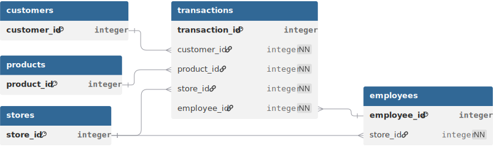

## Dataset Overview
The dataset represents a large-scale fictional fashion retail company operating across multiple countries and regions. It provides comprehensive transactional data capturing end-to-end retail operations, including customer orders, product sales, store performance, and multi-currency transactions.   
**Data Source** [here.](https://www.kaggle.com/datasets/ricgomes/global-fashion-retail-stores-dataset) 

 

**Dataset Summary:**
| Attribute             | Detail                                      |
| --------------------- | ------------------------------------------- |
| Date Range            | 2023-01-01 to 2025-03-18                    |
| Transaction Records   | 6.4M+                                       |
| Stores                | 35                                          |
| Countries             | 7 (China, USA, Portugal, Spain, France, Germany, UK) |
| Categories            | 3 (Masculine, Feminine, Children)           |
| Sub Categories        | 21                                          |
| Tables                | 6 relational tables                         |
---
## Data Quality Assessment
After loading the source files into the raw schema, data quality checks were performed across all tables. The dataset was generally well-structured, requiring only minor standardization, data cleansing, and currency normalization before analysis. Clean views were created to standardize the data before analysis and visualization.

| Table        | Column                            | Issue                                           | Fix Applied                           |
| ------------ | --------------------------------- | ----------------------------------------------- | ------------------------------------- |
| customers    | country                           | Mixed language country names                    | Standardized using CASE               |
|              | gender                            | Encoded values (M, F, D)                        | Converted to descriptive labels       |
|              | job_title                         | Empty strings                                   | NULLIF()                              |
| products     | color                             | Missing values, inconsistent casing             | LOWER(), COALESCE()                   |
|              | sizes                             | Missing values                                  | COALESCE('unknown')                   |
|              | production_cost                   | Inconsistent decimal precision                  | ROUND()                               |
| stores       | country                           | Mixed language country names                    | Standardized using CASE               |
|              | city, store_name                  | Chinese city, store names                       | Translated to English                 |
| discounts    | category, sub_category            | Empty strings                                   | NULLIF()                              |
|              | discount                          | Inconsistent decimal precision                  | ROUND()                               |
| transactions | duplicate records                 | Duplicate transaction lines                     | ROW_NUMBER() deduplication            |
|              | color                             | Missing values, whitespace, inconsistent casing | TRIM(), LOWER(), COALESCE()           |
|              | size                              | Empty strings                                   | NULLIF()                              |
|              | unit_price, line_total            | Multiple currencies                             | Converted to USD                      |
|              | discount                          | Inconsistent decimal precision                  | ROUND()                               |
|              | transaction_id                    | Missing surrogate key                           | Generated using ROW_NUMBER()          |
---
**SQL Scripts:**  
• [DDL](sql/ddl)  
• [Data Quality Checks](sql/test/raw_quality_checks.sql)  
• [Database init ](sql/db_init.sql)  